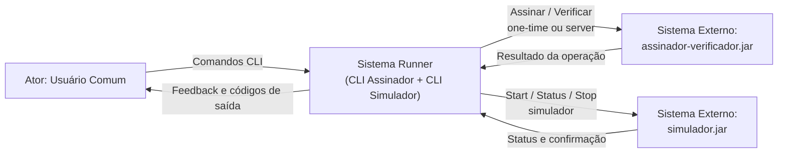
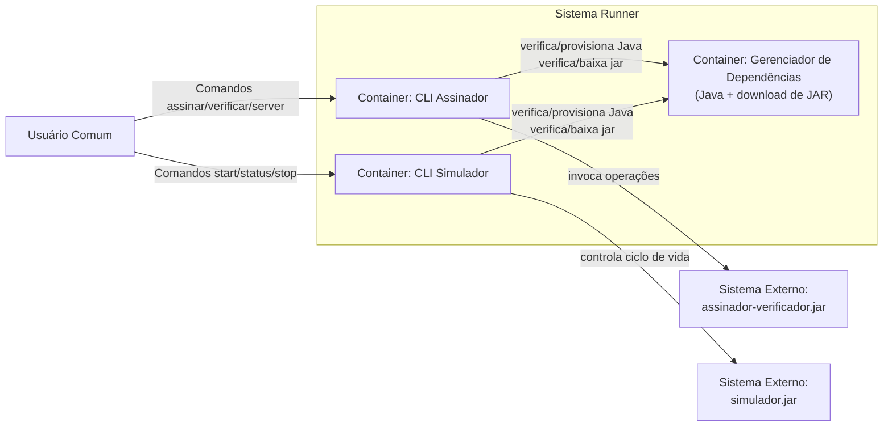
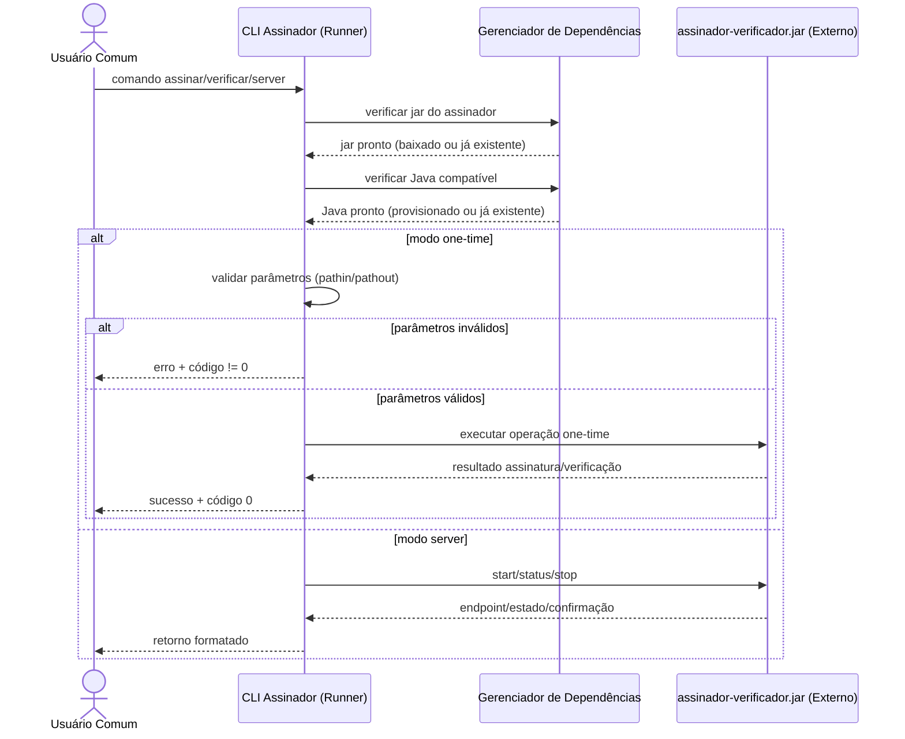
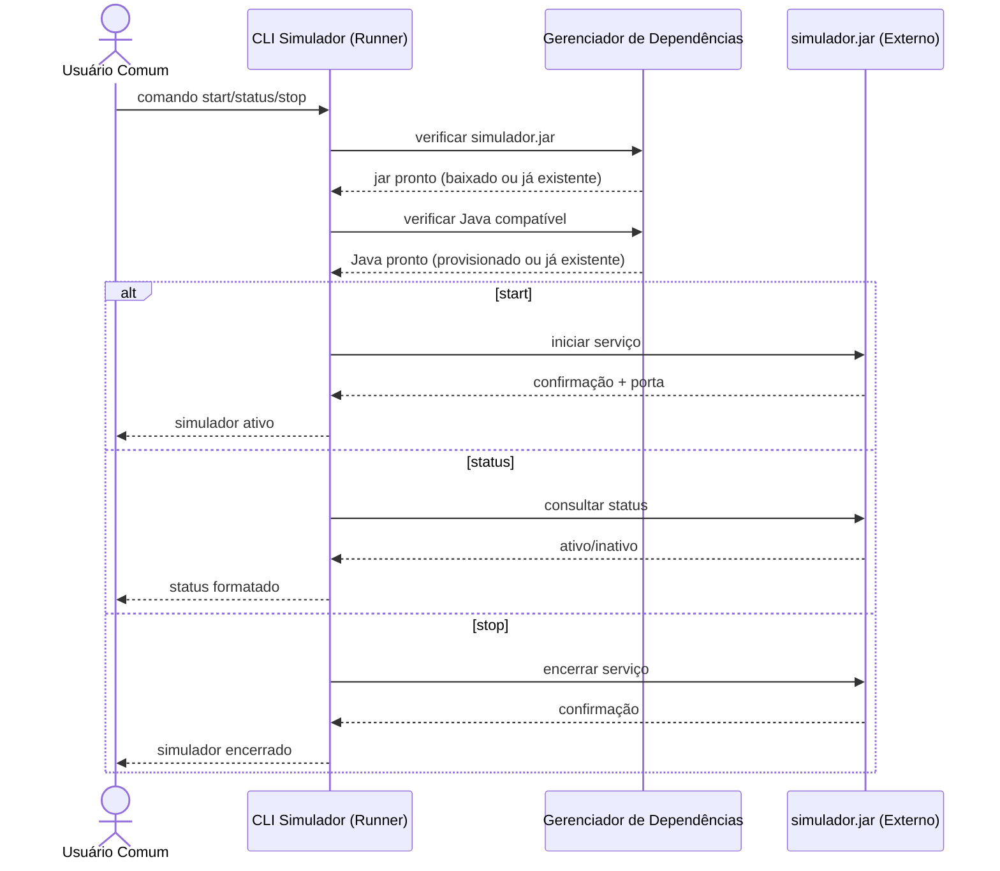

# Sistema Runner - Design Arquitetural (Mermaid)

Este documento consolida os diagramas arquiteturais em **Markdown + Mermaid**, com foco nas histórias de usuário atuais:
- o usuário interage com o **Sistema Runner** (que expõe os dois CLIs);
- os dois JARs são tratados como **sistemas externos**;
- o Runner valida dependências e orquestra a comunicação com os JARs.

---

## 1) Diagrama de Contexto

### Tabela descritiva (Contexto)

| Elemento | Tipo | Responsabilidade |
|---|---|---|
| Usuário Comum | Ator | Executa comandos nos CLIs sem precisar conhecer Java. |
| Sistema Runner | Sistema principal | Interface única de execução (CLI Assinador + CLI Simulador), valida dependências e orquestra chamadas. |
| assinador-verificador.jar | Sistema externo | Processa assinatura/verificação em modo one-time ou server. |
| simulador.jar | Sistema externo | Fornece serviço de simulação controlado por start/status/stop. |

---

## 2) Diagrama de Contêineres (visão interna do Runner)

### Tabela descritiva (Contêineres)

| Origem | Destino | Interface | Objetivo |
|---|---|---|---|
| Usuário Comum | CLI Assinador | CLI | Disparar assinatura/verificação e comandos server. |
| Usuário Comum | CLI Simulador | CLI | Controlar simulador com start/status/stop. |
| CLI Assinador | Gerenciador de Dependências | Chamada interna | Garantir Java e JAR antes de executar operações. |
| CLI Simulador | Gerenciador de Dependências | Chamada interna | Garantir Java e JAR antes de controlar o simulador. |
| CLI Assinador | assinador-verificador.jar | Processo local/HTTP | Executar one-time ou gerir server. |
| CLI Simulador | simulador.jar | Processo local/HTTP | Iniciar, consultar status e parar simulador. |

---

## 3) Diagrama de Sequência — Assinador (one-time e server)

### Tabela descritiva (Sequência Assinador)

| Etapa | Descrição |
|---|---|
| Pré-checagem | Runner garante presença de `assinador-verificador.jar` e Java antes da execução. |
| One-time | Runner valida parâmetros e só invoca o JAR se entrada estiver correta. |
| Server | Runner controla ciclo de vida do serviço (`start`, `status`, `stop`). |

---

## 4) Diagrama de Sequência — Simulador (start/status/stop)

### Tabela descritiva (Sequência Simulador)

| Etapa | Descrição |
|---|---|
| Pré-checagem | Runner valida presença de `simulador.jar` e Java antes dos comandos. |
| Start | Inicia o `simulador.jar` e devolve confirmação ao usuário. |
| Status | Consulta estado atual do serviço de simulação. |
| Stop | Finaliza o serviço de simulação com retorno explícito ao usuário. |
