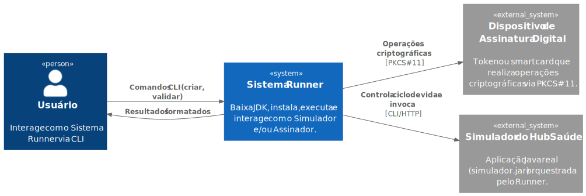
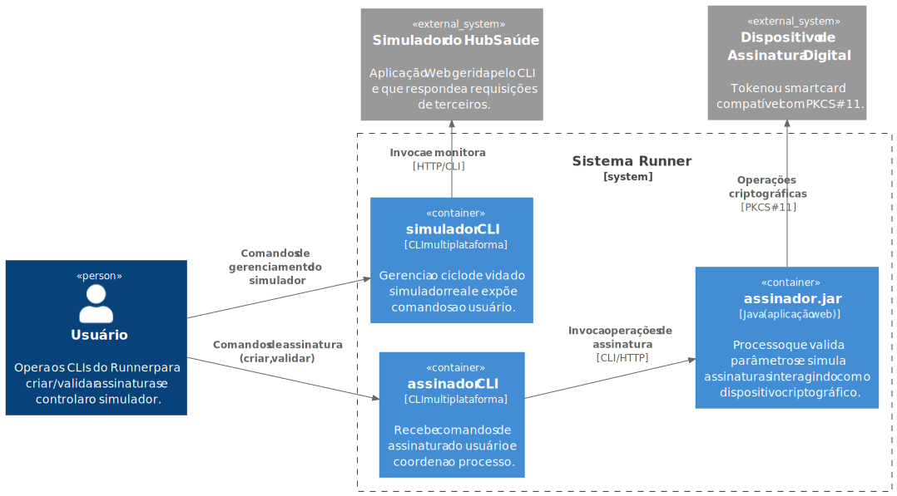

# Sistema Runner - Design

- O registro do design é organizado conforme o modelo C4. Consulte [C4 Model](https://c4model.com/) para detalhes.
- Diagramas empregam o PlantUml. Consulte [PlantUml](https://plantuml-documentation.readthedocs.io/en/latest/) para detalhes.
- Scripts (geraimagens.sh e geraimagens.bat) automatizam a geração de diagramas a partir dos arquivos .puml.

## 1. Diagrama de Contexto

**Atores e Sistemas Externos:**

| Elemento | Tipo | Descrição |
|----------|------|-----------|
| Usuário | Ator | Pessoa que interage com o sistema via linha de comandos |
| Dispositivo de Assinatura Digital | Sistema Externo | Hardware criptográfico (token USB, smart card) que armazena certificados e executa operações de assinatura |
| Simulador do HubSaúde | Sistema Externo | Aplicação Web gerida pelo CLI e que responde a requisições de terceiros |

## 2. Diagrama de Contêineres

**Comunicação entre contêineres:**

| Origem | Destino | Protocolo | Descrição |
|--------|---------|-----------|-----------|
| Usuário | assinador  | CLI | Comandos de assinatura (criar, validar) digitados no terminal |
| Usuário | simulador | CLI | Comandos de gerenciamento do simulador |
| assinador | assinador.jar | chamada de método ou HTTP | Invocação direta ou requisição HTTP (conforme modo de execução) |
| assinador.jar | Dispositivo Criptográfico | PKCS#11 | Interface padrão para comunicação com tokens e smart cards |
| simulador | Simulador do HubSaúde | HTTP | Invoca e monitora o ciclo de vida do simulador |

